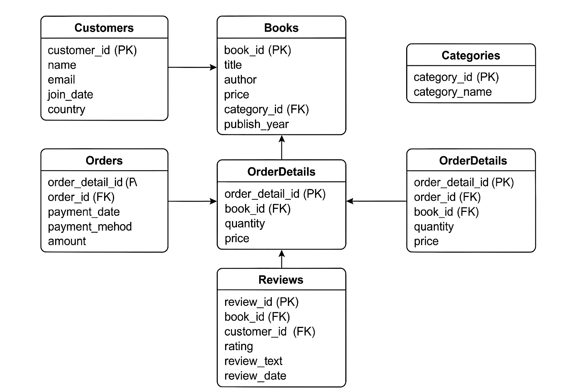

# 📚 Online Bookstore SQL Project

Welcome to the **Online Bookstore SQL Project** – a fully simulated relational database environment created to practice SQL, data analysis, and database design skills in a real-world scenario.

## 🚀 Project Overview

This project simulates an online bookstore's backend data system, complete with customers, books, orders, reviews, and payments. It's designed for practicing complex SQL queries, exploring business insights, and strengthening database management concepts.

---

## 🛠️ Tech Stack

- **Database:** SQL (PostgreSQL/MySQL Compatible)
- **Data Generation:** Python (Faker, Pandas)
- **Reporting:** PDF with Canva
- **Visualization:** ER Diagram (image)
- **File Formats:** Excel (.xlsx), SQL, PDF

---

## 📂 Dataset Details

The dataset includes 7 interlinked tables with realistic, randomly generated data:

| Table Name       | Description                          | Rows   |
|------------------|--------------------------------------|--------|
| `Categories`     | Book categories                      | 5      |
| `Customers`      | Customer information                 | 1000   |
| `Books`          | Books with prices, stock, category   | 1000   |
| `Orders`         | Customer orders and status           | 1000   |
| `OrderDetails`   | Books per order with quantity/price  | ~2000  |
| `Payments`       | Payment methods and dates            | ~700   |
| `Reviews`        | Customer reviews and ratings         | 1000   |

---

## 🔍 SQL Analysis Highlights

The project includes a **PDF report** with 10+ SQL queries and insights, such as:

- 📈 Monthly Sales Trend  
- 🏆 Top Customers by Spending  
- 📚 Best-Selling & Most-Reviewed Books  
- ⭐ Average Book Ratings  
- 🔍 Inactive Customers & Low Stock Books  
- 💳 Revenue by Payment Method

---

## 🖼️ ER Diagram

---

## 📦 Files Included

- `online_bookstore_data.xlsx` – All tables with 1000+ rows of synthetic data
- `Bookstore data analysis_compressed.pdf` – SQL queries and result explanations
- ER diagram image (`Schema.png`)

---

## ✨ How to Use

1. Clone the repo or download the Excel + PDF
2. Import tables into your SQL tool (e.g., PostgreSQL, MySQL, SQLite)
3. Run queries and experiment with your own
4. Use the project for learning, resume-building, or interviews!

---

## 📬 Let’s Connect!

If you found this helpful or have any suggestions, feel free to reach out or connect with me on [LinkedIn](https://www.linkedin.com/in/pranjalsaxena123)!

---

## 🏷️ Tags

`#SQL` `#DatabaseDesign` `#DataAnalysis` `#Python` `#PortfolioProject` `#DataScience` `#ERDiagram`
